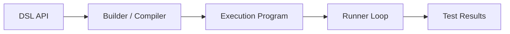
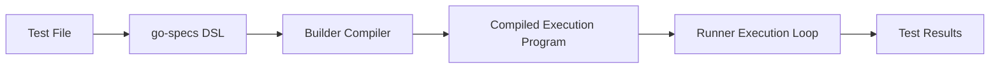
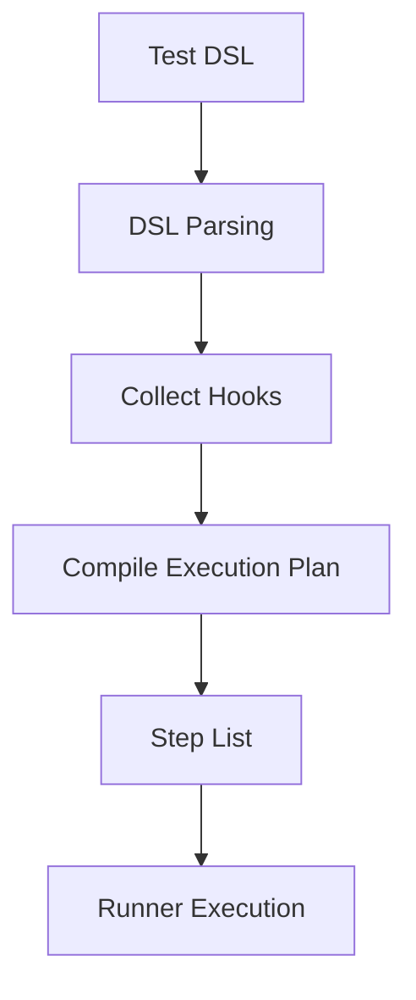
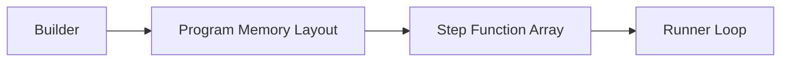
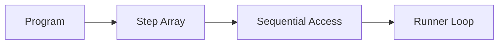
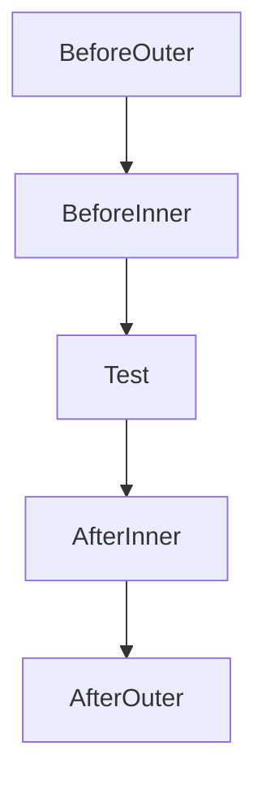
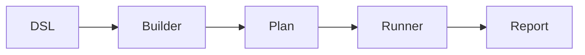

# Architecture

High-level architecture of go-specs: how tests are defined, compiled, and executed.

## Overview

The core architecture is a linear pipeline:

**DSL → Builder → Program → Runner**



Each component has a single responsibility:

| Component | Responsibility |
| --------- | -------------- |
| **DSL** | User-facing test definition. `Describe`, `BeforeEach`, `AfterEach`, and `It` (or the Builder API) register structure and callbacks. |
| **Builder** | Compiles DSL constructs into an execution program. Resolves hooks at compile time and produces a flat list of steps or groups. |
| **Program** | A compiled execution plan containing test steps. Either a flat instruction stream with per-spec bounds (ExecutionPlan) or groups of before/specs/after steps (Program). No tree structure at run time. |
| **Runner** | Executes steps sequentially with minimal overhead. Gets a Context from a pool, runs each step in order, and returns the Context to the pool. No hook resolution or reflection. |

Heavy work (parsing, hook collection, plan construction) happens during **compilation**; execution is a thin loop over the compiled plan. See [PERFORMANCE.md](PERFORMANCE.md) for execution cost and scaling.

---

## DSL → Execution pipeline (full lifecycle)

The full lifecycle from user code to test results:



| Stage | Description |
| ----- | ----------- |
| **Test file** | User writes a `*_test.go` file and calls `Describe(t, "name", ...)` (or uses the Builder API). |
| **go-specs DSL** | `Describe`, `BeforeEach`, `AfterEach`, and `It` register scope and callbacks with the compiler. |
| **Builder compiler** | Flattens hooks and specs into a linear execution plan. No tree is retained at run time. |
| **Compiled execution program** | A flat list of steps (or groups of steps). Each step is `func(*Context)`. |
| **Runner execution loop** | Iterates over the plan and calls each step with a pooled Context. Zero allocations in the loop. |
| **Test results** | Pass/fail is reported via the test backend (`*testing.T`); the runner does not interpret assertions. |

---

## Test compilation model

A test definition is turned into executable steps by parsing the DSL, collecting hooks, and compiling a step list.

**Example DSL:**

```go
Describe(t, "math", func(s *specs.Spec) {
    s.BeforeEach(setup)
    s.It("adds numbers", testAdd)
})
```



1. **DSL parsing** — The compiler receives the `Describe` callback and runs it; each `BeforeEach` and `It` call registers a hook or spec.
2. **Collect hooks** — Before and after hooks are pushed onto scope stacks (outer to inner). When an `It` is seen, the current stacks define that spec’s hooks.
3. **Compile execution plan** — For each spec, the compiler emits a sequence: before hooks (outer→inner), body, after hooks (inner→outer). The result is a single flat step list (or grouped steps for the Program model).
4. **Step list** — The plan is a slice of `func(*Context)`. No metadata is needed at run time beyond the function pointers.
5. **Runner execution** — The runner loops over the step list and invokes each step with the same Context.

No maps, no reflection, and no per-spec allocation in the runner loop.

---

## Memory layout (why the framework is fast)

The builder produces a plan that is nothing more than a flat slice of function pointers. The runner then walks that slice in order.



Steps are compiled into a **flat slice of function pointers**. There are no maps, no trees, and no per-step metadata in the hot path. The runner just does `for i := range steps { steps[i](ctx) }`, which gives sequential memory access and direct function dispatch. That keeps the inner loop small and cache-friendly.

### Memory access pattern

The runner reads step functions sequentially from memory—no random access or pointer chasing.



Sequential access is cache-friendly: the CPU can prefetch the next steps while executing the current one. See [PERFORMANCE.md](PERFORMANCE.md) for more on execution cost and scaling.

---

## Hook execution path

Nested before/after hooks are compiled into a linear sequence; at run time there is no tree traversal.



Hooks are **compiled into the execution plan** and do not require runtime traversal. The builder flattens scope and emits one sequence per spec (outer before → inner before → spec body → inner after → outer after). The runner executes that sequence as a straight line of steps with no lookup or recursion.

---

## Internal package architecture

High-level responsibilities of the main packages:



| Package | Role |
| ------- | ---- |
| **specs** | Public DSL (`Describe`, `BeforeEach`, `AfterEach`, `It`), Builder API, compiler, ExecutionPlan/Program types, Runner, and Context. Entry point for all user code. |
| **internal/plan** | Execution plan representation and construction (when using the arena/registry path). Used by the analyzer; plan execution is in internal/plan (RunIDs). The public runner lives in specs. |
| **report** | Reporting and formatting (e.g. for structured output). Used by the runner when a reporter is configured. |
