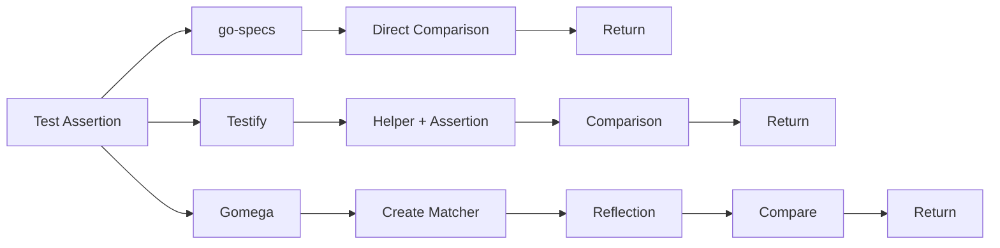
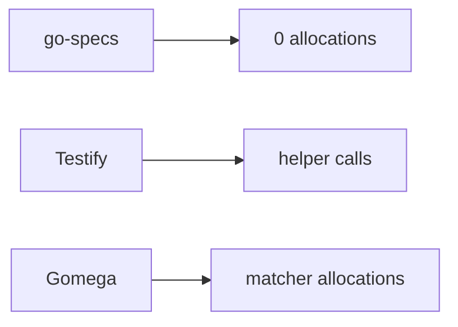
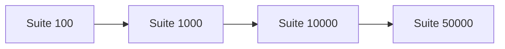

# Benchmarks

Benchmark methodology, environment, and results for go-specs compared with Testify and Gomega.

## Hardware and environment

| Item | Value |
| ---- | ----- |
| **Hardware** | Apple M4 Max |
| **Go version** | Go 1.26+ (see [go.mod](../go.mod)) |

## Benchmark command

From the repository root:

```bash
go test ./benchmarks -bench=. -benchmem
```

Setup (building the suite, creating the runner) is done before `b.ResetTimer()` so the reported time and allocations reflect only the measured loop.

## Assertions

Single equality assertion (same comparison across frameworks):

| Assertion                 | ns/op   | allocs |
| ------------------------- | ------- | ------ |
| GoSpecs EqualTo           | ~1 ns   | 0      |
| GoSpecs Expect().ToEqual  | ~7 ns   | 0      |
| Testify assert.Equal      | ~86 ns  | 0      |
| Gomega Expect().To(Equal) | ~238 ns | 3      |

### Assertion execution cost

Execution paths differ by framework. go-specs avoids matcher allocation and reflection on the hot path.



go-specs takes a direct comparison path; Testify adds helper and assertion layers; Gomega allocates matchers and uses reflection. See [PERFORMANCE.md](PERFORMANCE.md) for details.

## Runner

Full suite run (1000 specs, one assertion per spec). Time per run:

| Framework | Time    |
| --------- | ------- |
| GoSpecs   | ~1.7 µs |
| Testify   | ~86 µs  |
| Gomega    | ~238 µs |

## Why go-specs is faster

- **No reflection** — Assertions use generics and direct comparison. The fast path does not use `reflect.DeepEqual` or runtime type switches.
- **Compiled execution plan** — Suites are compiled once into a flat list of steps. The runner does not resolve hooks or look up specs at run time.
- **Zero allocations** — Context and expectations are pooled; the assertion and runner success path allocate nothing in the measured loop.
- **Simple runner loop** — The runner just iterates over steps and calls `step(ctx)`. No maps, no reflection, no per-spec allocation.

### Allocation comparison

go-specs performs no allocations during test execution on the success path; other frameworks incur helper or matcher allocations.



See [PERFORMANCE.md](PERFORMANCE.md) for execution cost diagrams and design choices.

## Scaling and benchmark scaling visualization

Large-suite benchmarks measure how execution time scales with the number of specs (100, 1000, 10000, 50000). Suite creation is outside the timed region; only execution is measured.



Runtime scales **linearly** with suite size because execution is a simple sequential loop over the compiled step list. Doubling the number of specs doubles the number of steps and thus roughly doubles run time; there is no extra per-spec overhead from maps, reflection, or allocation in the runner.

Run large-suite benchmarks:

```bash
go test ./benchmarks -bench=BenchmarkSuite_ -benchmem
```

## Further reading

- [PERFORMANCE.md](PERFORMANCE.md) — Why go-specs is fast: assertion cost, runner loop, allocation behavior, scaling, and design choices.
- [benchmarks/README.md](../benchmarks/README.md) — Full benchmark suite layout, categories, and scripts (benchstat, charts).
- [ARCHITECTURE.md](ARCHITECTURE.md) — How the DSL compiles to a program and how the runner executes it.
