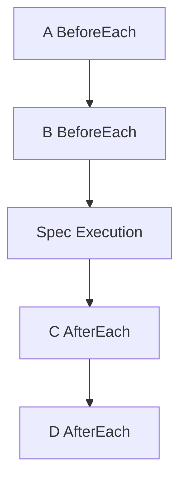

# DSL API

The go-specs DSL is the user-facing API for defining tests. This document describes each construct and execution order.

## Describe

`Describe` starts a suite or a nested block. It takes a test handle (`*testing.T` or `*testing.B`), a name, and a callback that receives a `*Spec`.

```go
specs.Describe(t, "math", func(s *specs.Spec) {
    // register hooks and specs on s
})
```

Nested `Describe` (when using the Builder API) creates nested scope; hooks from outer blocks run before and after inner specs.

## BeforeEach

`BeforeEach` registers a function that runs before every `It` in the current scope (and nested scopes). Use it for setup that must run before each spec.

```go
s.BeforeEach(func(ctx *specs.Context) {
    // reset state, create fixtures, etc.
})
```

Multiple `BeforeEach` calls in the same scope run in registration order (outer scope first, then inner).

## AfterEach

`AfterEach` registers a function that runs after every `It` in the current scope. Execution order is **LIFO**: innermost after runs first, then outer.

```go
s.AfterEach(func(ctx *specs.Context) {
    // teardown, release resources
})
```

## It

`It` registers a single spec (test case). The function receives the execution context.

```go
s.It("adds numbers", func(ctx *specs.Context) {
    ctx.Expect(1 + 1).ToEqual(2)
})
```

Each `It` is compiled into a step sequence: before hooks (outer to inner), then the spec body, then after hooks (inner to outer).

## ItParallel

`ItParallel` registers a spec that runs in parallel with adjacent `ItParallel` specs. It is available on the **Builder** API, not on the top-level `Describe` path.

```go
b := specs.NewBuilder()
b.Describe("suite", func() {
    b.ItParallel("A", func(ctx *specs.Context) { ctx.Expect(add(1, 1)).ToEqual(2) })
    b.ItParallel("B", func(ctx *specs.Context) { ctx.Expect(add(2, 2)).ToEqual(4) })
})
prog := b.Build()
specs.NewRunner(prog).Run(t)
```

Consecutive `ItParallel` specs are grouped into one parallel step; they run concurrently, then execution continues with the next sequential step.

## Expect and EqualTo

Assertions use the context. Two main styles:

**`EqualTo`** — Direct equality; zero allocations on the fast path.

```go
specs.EqualTo(ctx, actual, expected)
```

**`Expect` / `ToEqual`** — Fluent style; still zero allocations when using `ExpectT(ctx, x).ToEqual(y)` for comparable types.

```go
ctx.Expect(1 + 1).ToEqual(2)
// or with matchers:
ctx.Expect(value).To(specs.BeTrue())
ctx.Expect(value).To(specs.Equal(expected))
```

`ExpectT(ctx, x).ToEqual(y)` is the preferred form for typed equality; it avoids matcher allocations.

## Example

```go
package math_test

import (
    "testing"
    "github.com/getsyntegrity/go-specs/specs"
)

func setup(ctx *specs.Context) {
    // per-spec setup
}

func TestMath(t *testing.T) {
    specs.Describe(t, "math", func(s *specs.Spec) {
        s.BeforeEach(setup)

        s.It("adds numbers", func(ctx *specs.Context) {
            ctx.Expect(1 + 1).ToEqual(2)
        })
    })
}
```

## Execution order of hooks

For nested describes, before hooks run **outer to inner**; after hooks run **inner to outer** (LIFO).

**Example:**

- `Describe("outer")` with `BeforeEach` A and `AfterEach` D  
- `Describe("inner")` with `BeforeEach` B and `AfterEach` C  
- One `It` (test)

Execution order:

**A → B → test → C → D**



So: outer before (A), then inner before (B), then the spec body, then inner after (C), then outer after (D). This order is fixed at compile time when the builder flattens hooks into the step list.
