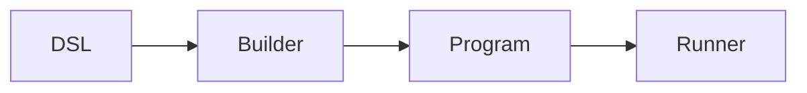
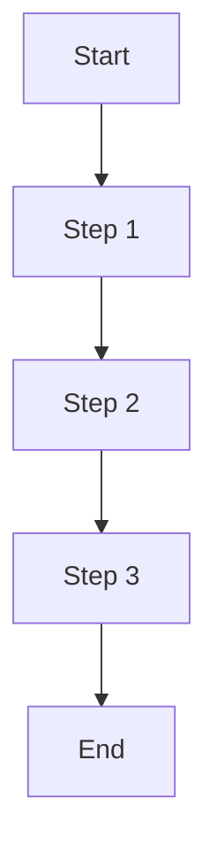
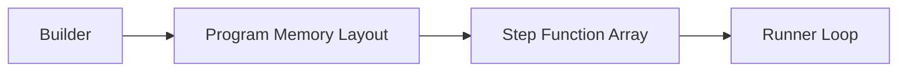
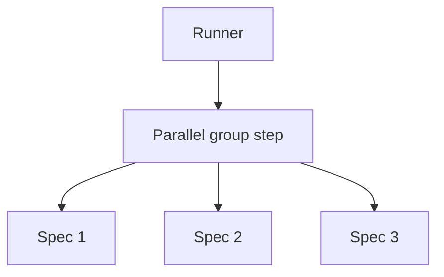

# Execution Model

How go-specs compiles and runs tests: the execution pipeline, program structure, and performance properties.

## Execution pipeline

The end-to-end flow is:

**DSL → Builder → Program → Runner**



1. **DSL** — User defines suites with `Describe`, `BeforeEach`, `AfterEach`, `It` (and optionally the Builder API with `ItParallel`).
2. **Builder** — Compiler (or Builder) flattens scope and hooks into a linear plan. No tree is kept at run time.
3. **Program** — The plan is either a flat slice of instructions with per-spec bounds (ExecutionPlan) or a slice of groups, each with before/specs/after steps (Program).
4. **Runner** — Iterates over the plan and invokes each step with a shared Context.

## Execution plan

The compiled artifact is conceptually a list of steps. Each step is a function:

```go
step func(*Context)
```

The runner does not branch on step type for the hot path; it just calls the function. Hooks and spec bodies are all steps; the compiler has already laid them out in the correct order (before hooks, body, after hooks per spec, or grouped for the Program model).

**Execution loop (conceptual):**

```go
ctx := contextPool.Get().(*Context)
ctx.Reset(backend)
for i := 0; i < len(steps); i++ {
    steps[i](ctx)
}
ctx.Reset(nil)
contextPool.Put(ctx)
```

For the ExecutionPlan path, the loop is over instructions within each spec’s slice; for the Program path, it is over groups and then over before/specs/after within each group. In both cases there is a single, flat iteration—no recursion or map lookups.

## Performance properties

- **Zero allocations** — Context (and expectation objects) are pooled. The runner reuses one Context per spec (or per group). On the assertion fast path, no heap allocations occur on success.
- **Sequential memory access** — The plan is a contiguous slice (or a small number of slices). The runner walks them in order, which is cache-friendly.
- **No reflection** — Steps are plain function pointers. Assertions use generics and direct comparison where possible; no `reflect.DeepEqual` or type switches on the hot path.
- **Direct function calls** — Each step is invoked as `step(ctx)`. No indirection or dynamic dispatch in the inner loop.

## Runner loop execution

The runner executes compiled steps in a single loop. Conceptually:



The runner does:

```go
for i := 0; i < len(steps); i++ {
    steps[i](ctx)
}
```

There is no branching on step type in the hot path; the compiler has already laid out steps in the correct order (e.g. before hooks, body, after hooks). The runner just executes them in sequence.

**Properties:**

- **Zero allocations** — The loop does not allocate; Context and expectations are pooled.
- **Sequential memory access** — Walking a slice of function pointers is cache-friendly.
- **No reflection** — Steps are plain function pointers; no type switches or reflection in the inner loop.
- **Direct function dispatch** — Each step is invoked as `step(ctx)`; no indirection.

---

## Memory layout concept

The compiled program is a flat slice of function pointers. The builder produces this layout; the runner consumes it in order.



Steps are compiled into a **flat slice of function pointers**. There are no maps, no trees, and no per-step metadata in the hot path. That keeps the inner loop small and cache-friendly and is a key reason the framework is fast.

---

## Parallel execution model

When using `ItParallel`, consecutive parallel specs are grouped into a single execution step. That step runs the specs concurrently; the runner then continues with the next sequential step.



The builder groups parallel specs into one step; the runner executes that step (e.g. by launching goroutines and waiting). So from the runner’s perspective, a parallel group is still just one step in the flat plan.
