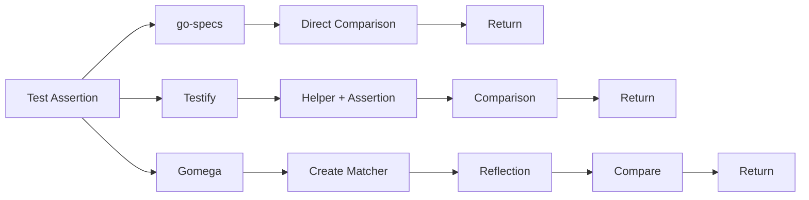
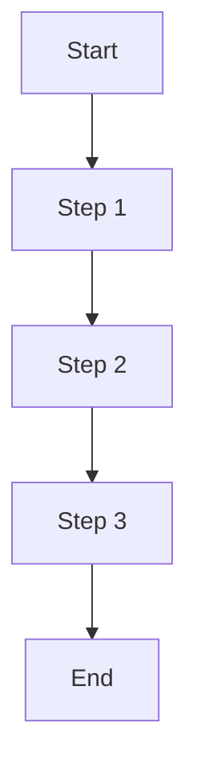
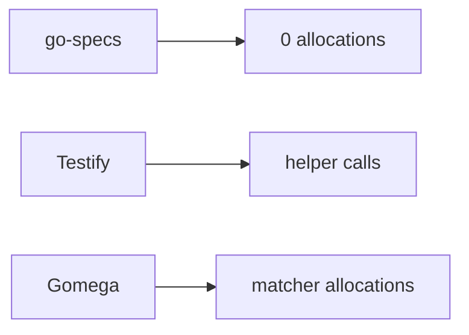
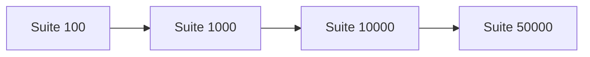
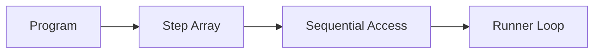
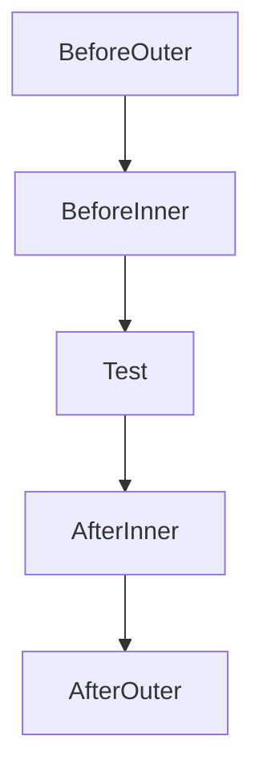
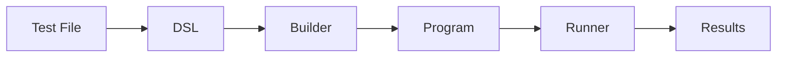

# Performance

This document explains why go-specs is extremely fast: execution cost, allocation behavior, scaling, and the design choices that enable sub-nanosecond assertions and microsecond-scale suite runs.

---

## 1. Assertion execution cost

Execution paths differ sharply between frameworks. go-specs uses a direct comparison path with no matcher allocation or reflection.



- **go-specs** — One direct comparison (e.g. `actual == expected` for comparable types). No matcher object, no reflection. The fast path is a few instructions.
- **Testify** — Helper and assertion machinery add overhead before comparison; no reflection on the equality path but more call depth and branching.
- **Gomega** — Allocates matcher objects and uses reflection for comparison, which is significantly more expensive.

go-specs avoids matcher allocation and reflection entirely on the assertion hot path, which is why a single equality assertion is ~1 ns (EqualTo) or ~7 ns (Expect/ToEqual) versus ~86 ns (Testify) or ~238 ns (Gomega).

---

## 2. Runner execution cost

The runner executes steps with a minimal loop: no branching on step type, no maps, no per-step allocation.



Execution is a simple sequential loop:

```go
for i := 0; i < len(steps); i++ {
    steps[i](ctx)
}
```

This gives:

- **Predictable branch patterns** — The loop has one branch (loop condition). No type switches or map lookups in the hot path.
- **CPU cache friendliness** — Steps are stored in a contiguous slice; the runner reads function pointers in order, which prefetchers handle well.
- **Minimal dispatch cost** — Each step is a direct function call. No indirection, no reflection, no interface method lookup in the inner loop.

---

## 3. Allocation comparison

Allocation behavior during test execution differs greatly between frameworks.



go-specs performs **no allocations during test execution** on the success path. Context and expectation objects are pooled; the runner reuses one Context per spec (or per group). Assertions use generics and direct comparison, so no heap allocations occur for typical equality checks.

Testify’s assertion path avoids reflection but still involves helper and formatting code paths that can allocate in failure cases; the success path is low-allocation. Gomega allocates matcher objects and supporting structures per expectation, leading to multiple allocations per assertion.

---

## 4. Suite scaling

Runtime scales linearly with the number of specs because execution is a flat loop over a precompiled step list.



Execution has **O(n) complexity**: double the specs, double the steps, and roughly double the run time. There is no extra per-spec cost from hook resolution, map lookups, or allocation. Large suites (tens of thousands of specs) run in microseconds because the inner loop is just stepping through a slice and calling functions.

---

## 5. Memory access pattern

The execution plan is a flat slice of step functions. The runner reads them sequentially.



The runner reads step functions **sequentially from memory**. No random access, no pointer chasing through trees or maps. Sequential access is cache-friendly: the CPU can prefetch the next steps while executing the current one. This keeps the inner loop small and predictable.

---

## 6. Hook execution path

Nested before/after hooks are compiled into the execution plan. At run time there is no tree traversal—just a linear sequence of steps.



Hooks are **compiled into the execution plan** and do not require runtime traversal. The builder flattens scope and emits one sequence per spec (e.g. outer before → inner before → spec body → inner after → outer after). The runner executes that sequence as Step 1, Step 2, … with no lookup or recursion. Hook order is fixed at compile time.

---

## 7. Execution pipeline

Heavy work happens during compilation; execution is a thin loop over the compiled plan.



Parsing, hook collection, and plan construction happen in the **Builder** when the suite is created. By the time the **Runner** runs, the plan is a flat list of function pointers. The runner does not parse DSL, resolve hooks, or allocate per spec—it just iterates and calls. So execution cost is dominated by the user’s test code and assertions, not by framework machinery.

---

## 8. Performance summary

The main design choices that make go-specs extremely fast:

| Choice | Effect |
| ------ | ------ |
| **Compiled execution plan** | Suites are compiled once into a flat step list. No hook resolution or tree traversal at run time. |
| **Zero allocations** | Context and expectations are pooled; the assertion and runner success path allocate nothing. |
| **No reflection** | Assertions use generics and direct comparison. No `reflect.DeepEqual` or type switches in the hot path. |
| **Direct function dispatch** | Each step is invoked as `step(ctx)`. No indirection or dynamic dispatch in the inner loop. |
| **Sequential memory access** | The plan is a contiguous slice; the runner walks it in order, which is cache-friendly. |

Together, these allow go-specs to execute a single equality assertion in **~1 ns** and full suites of **tens of thousands of specs in microseconds**, with no allocations on the success path and linear scaling with suite size.

## Further reading

- [BENCHMARKS.md](BENCHMARKS.md) — Benchmark numbers, methodology, and scaling results.
- [ARCHITECTURE.md](ARCHITECTURE.md) — How the DSL compiles to a program and how the runner executes it.
- [EXECUTION_MODEL.md](EXECUTION_MODEL.md) — Execution plan structure and runner loop in more detail.
